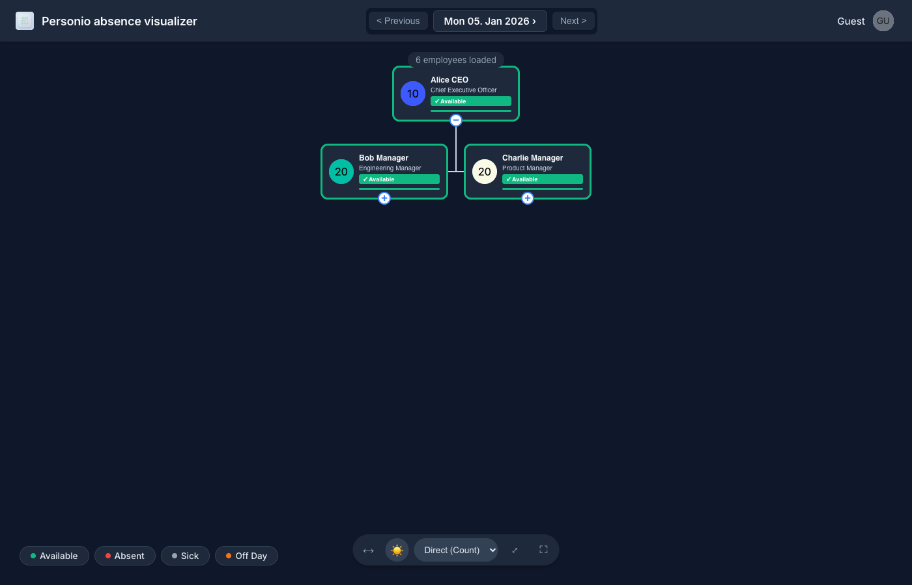

# Personio Absence Visualizer


A modern, interactive organizational chart that visualizes employee attendance and absences in real-time using the Personio API. Built with React and Node.js, featuring a premium UI with Dark Mode support.

## Key Features

- 📊 **Smart Org Chart**: Interactive visualization of your company's hierarchy.
- 🎨 **Status Visualization**: Color-coded borders and indicators for attendance, absences, and sick leave.
- 🌓 **Dark Mode**: Premium dark interface with automatic state persistence.
- 🌓 **Half-Day Absences**: Intelligent rendering of AM/PM absences with split-color borders.
- ⚕️ **Sick Leave Detection**: Language-agnostic recognition of sick leave (Krankheit/Illness).
- 📅 **Contextual Navigation**: Quick-link to Personio profiles with auto-selected month/year parameters.
- 📱 **Responsive Design**: Works seamlessly on desktops and large displays.
- 🔒 **Secure Auth**: Integrates with Microsoft Entra ID (Azure AD) for secure SSO and access control.
- 🚀 **Demo Mode**: Automatic fallback to rich dummy data when Personio credentials are missing, perfect for testing and evaluation.

## Screenshots

<p align="center">
  
  
</p>


## Documentation

- 📚 [Getting Started](#setup-instructions)
- 🤝 [Contributing Guidelines](CONTRIBUTING.md)
- ⚖️ [License](LICENSE)
- 🛡️ [Code of Conduct](CODE_OF_CONDUCT.md)
- 🏗️ [Technical Architecture & API Details](ARCHITECTURE.md)

## Prerequisites

- Node.js 18 or higher
- npm or yarn
- Personio API credentials (`client_id` and `client_secret`)
- A Microsoft 365 tenant with permissions to create App registrations and Enterprise Apps in Azure Entra ID

## Setup Instructions

### 1. Get Personio API Credentials

1. Log in to your Personio account
2. Go to **Settings > Integrations > API credentials**
3. Click **Generate new credentials**
4. Note down your `client_id` and `client_secret`
5. In the API credentials wizard, whitelist the following employee attributes (used by the org chart and schedule logic):
   - id
   - first_name
   - last_name
   - email
   - position
   - supervisor
   - department
   - office
   - status
   - work_schedule
   - holiday_calendar
   - weekly_working_hours

### 2. Install Dependencies

All dependencies are already installed. If you need to reinstall:

```bash
npm run install:all
```

### 3. Configure environment variables

Create a shared `.env` file in the project root based on the provided example:

```bash
cp .env.example .env
```

Then edit `.env` and add your credentials:

```env
# Azure Entra ID (safe for frontend)
AZURE_TENANT_ID=your_tenant_id_here
AZURE_CLIENT_ID=your_azure_app_client_id_here
VITE_AZURE_TENANT_ID=your_tenant_id_here
VITE_AZURE_CLIENT_ID=your_azure_app_client_id_here

# Personio API (backend only)
PERSONIO_CLIENT_ID=your_client_id_here
PERSONIO_CLIENT_SECRET=your_client_secret_here

# Optional: Custom name for the organization root node (default: "Organization")
COMPANY_NAME=Your Company Name

ALLOWED_ORIGIN=https://your-domain.com
PORT=8080
```

> For production Docker deployments you pass these as container environment variables instead of a `.env` file. See the **Docker deployment** section below.

The backend and frontend are both configured to read from this shared root `.env` file. Do not create separate `.env` files in the subdirectories.

### 5. Start the Application (local dev)

Start both backend and frontend with a single command:

```bash
npm start
```

This will:

- Start the backend server on `http://localhost:8080`
- Start the frontend dev server on `http://localhost:3000`
- Open both in the same terminal with color-coded output

### 6. Demo Mode (Optional)

If you want to try out the app without connecting your own Personio account, simply leave the `PERSONIO_CLIENT_ID` and `PERSONIO_CLIENT_SECRET` empty or unset in your `.env` file.

The application will automatically detect the missing credentials and switch to **Demo Mode**, serving rich mock data that showcases hierarchy, various absence types, and status visualizations.

To also bypass Microsoft login in Demo Mode, set `AUTH_ENABLED=false` in your `.env`.

## Usage

1. Start the application: `npm start`
2. Open your browser and navigate to `http://localhost:3000`
3. You will be redirected to Microsoft 365 for sign-in via MSAL (using Azure Entra ID)
4. After a successful login, the application will automatically load:
   - All employees from your Personio account
   - Absence and presence data for the selected month
   - Time-off type definitions
5. Use the date picker to select any day; the chart will update automatically.
6. The organizational chart will update to show employee status for the selected date.

### Date Picker Controls

- **Previous/Next buttons**: Navigate day by day
- **Date display**: Click the date to open the native date picker calendar

## Troubleshooting

### "Failed to fetch data" Error

- Ensure the backend server is running on the configured port (default: 8080)
- Check that your Personio API credentials are correct in `.env`
- Verify your network connection

### "No organizational structure available"

- Make sure the `supervisor` attribute is whitelisted in Personio API settings
- Check that employees have supervisor relationships defined in Personio

### Profile pictures not loading

- Verify that the `profile-picture` attribute is accessible via the API
- Check browser console for specific error messages
- The app will fall back to showing employee initials

### CORS errors

- Make sure you're accessing the frontend via `http://localhost:3000`, not directly opening the HTML file
- Ensure the backend server is properly configured and running

## Production Deployment

### Azure Entra ID (Microsoft 365) configuration

The following steps must be performed in the Azure portal by a tenant administrator:

1. **Create an App registration (SPA)**
   1. Go to the Azure portal: https://portal.azure.com/
   2. Navigate to **Azure Active Directory → App registrations**: https://portal.azure.com/#view/Microsoft_AAD_RegisteredApps/ApplicationsListBlade
   3. Click **New registration** and create an app for the schedule viewer.
   4. Note the **Application (client) ID** → use this for `AZURE_CLIENT_ID` / `VITE_AZURE_CLIENT_ID`.
   5. Set the redirect URI type to **Single-page application (SPA)** and add:
      - `http://localhost:3000` (local dev)
      - `https://your-production-domain.example.com` (production)

2. **Create an Enterprise application and require assignment**
   1. Go to **Azure Active Directory → Enterprise applications**: https://portal.azure.com/#view/Microsoft_AAD_IAM/EnterpriseApplicationsListBlade
   2. Find the app you registered above (it should appear as an Enterprise app).
   3. In **Properties**, set **Assignment required?** to **Yes**.
   4. In **Users and groups**, assign the specific M365 group(s) or users who should be allowed to use the app.

3. **Optional: Define an application permission / scope for the API**
   - If you register a custom API resource, configure a scope like `api://<client_id>/.default` and update the `loginRequest.scopes` in `frontend/src/authConfig.js` accordingly.

> Users who are not assigned to the Enterprise app will be blocked by Microsoft before they ever reach the application (either during login or token acquisition).

### Docker deployment (single container)

1. Pull or Build the Docker image:

   **Pull from GitHub Container Registry (recommended):**
   ```bash
   docker pull ghcr.io/nolanus/personio-absence-visualize:latest
   # Or a specific version/SHA:
   # docker pull ghcr.io/nolanus/personio-absence-visualize:sha-31829e7
   ```

   **Or Build locally:**
   ```bash
   docker build -t personio-absence-visualize .
   ```

2. Run the container with the required environment variables: (using the image name from above)

   ```bash
   docker run \
     -e PERSONIO_CLIENT_ID=your_client_id_here \
     -e PERSONIO_CLIENT_SECRET=your_client_secret_here \
     -e AZURE_TENANT_ID=your_tenant_id_here \
     -e AZURE_CLIENT_ID=your_azure_app_client_id_here \
     -e AUTH_ENABLED=true \
     -e COMPANY_NAME="Your Company Name" \
     -e ALLOWED_ORIGIN=https://your-production-domain.example.com \
     -e PORT=8080 \
     -p 8080:8080 \
     ghcr.io/nolanus/personio-absence-visualize:latest
   ```

### Docker Compose (recommended)

For a more manageable setup, use the provided `docker-compose.yml`.

1. Create a `.env` file in the root with your secrets.
2. Run with Docker Compose:

   ```bash
   docker-compose up -d --build
   ```

3. Open the app in your browser:
   - `https://your-production-domain.example.com` (behind your reverse proxy / load balancer), or
   - `http://localhost:8080` when testing the container locally.

> The Node.js process inside the container runs as a non-root user for additional security. Personio credentials are never logged or sent to the browser.

### UAT: verify restricted access

To verify that only assigned users can access the schedule viewer:

1. Ask an administrator to **remove a test user** from the app’s assigned users/groups in Azure Entra ID.
2. Have that user try to open the application URL.
3. Expected result:
   - Microsoft shows an access denied / not assigned error during login **or**
   - The SPA fails to obtain a token and shows the **Authentication error** message in the UI.

## License

MIT

## Support

For issues related to:

- **Personio API**: Check the [Personio Developer Hub](https://developer.personio.de/)
- **This application**: Open an issue on this repository
